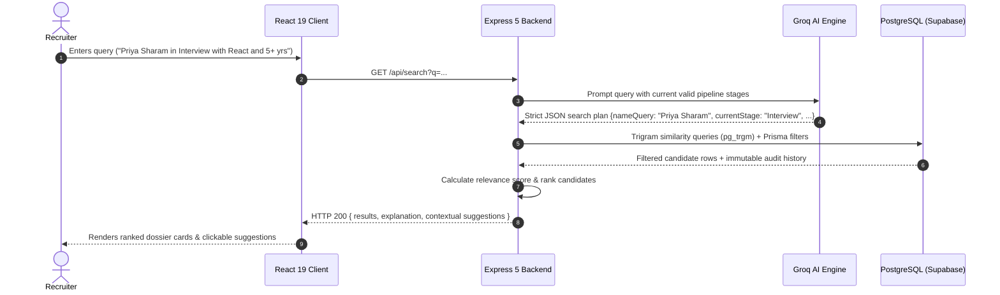

# Recruitment Management & AI Candidate Pipeline Platform

A modern, high-performance Recruitment Candidate Management and Natural Language Search platform built with **React 19**, **TypeScript**, **Node.js (Express 5)**, **Prisma ORM**, **PostgreSQL (Supabase)**, and **Groq Cloud AI**.

---

## 🔗 Repository & Deliverables
- **Live Application Demo (Frontend)**: [https://recruitment-software-joq491vti-ayush-kumars-projects-8e4c77e0.vercel.app/](https://recruitment-software-joq491vti-ayush-kumars-projects-8e4c77e0.vercel.app/)
- **Live API Service (Render Backend)**: [https://recruitment-backend-iotr.onrender.com/api/candidates](https://recruitment-backend-iotr.onrender.com/api/candidates)
- **GitHub Repository**: [https://github.com/ayushprajapati3002/RecruitmentSoftware](https://github.com/ayushprajapati3002/RecruitmentSoftware)
- **Architecture Documentation**: [docs/ARCHITECTURE.md](docs/ARCHITECTURE.md)
- **Architecture PDF Summary**: [docs/Recruitment_Software_Architecture.pdf](docs/Recruitment_Software_Architecture.pdf)
- **AI Chat Logs & Audit**: [AI_CHAT_LOGS/README.md](AI_CHAT_LOGS/README.md) & [AI_CHAT_LOGS/SESSION_HISTORY.md](AI_CHAT_LOGS/SESSION_HISTORY.md)

---

## ⚡ Key Features & Capabilities

- **Strict Forward Pipeline Workflow**:
  - Structured stage progression: `Applied` ➔ `Screening` ➔ `Interview` ➔ `Offer` ➔ `Hired`.
  - Rejection support from any non-terminal stage into `Rejected`.
  - Terminal stage enforcement preventing regressions or status corruption.
  - Zero-delay **Optimistic UI updates** for instant drag/click movements without waiting on network roundtrips.
- **Natural Language Search Engine (NLP)**:
  - **Natural Query Interpretation**: Converts conversational recruiter queries into typed, structured search plans (e.g., *"Find Priya Sharam"*, *"Who is in Interview right now?"*, *"React developers with 5+ years in Interview in Delhi"*, *"Who has been stuck in Screening for more than a week?"*, *"Who moved to Interview since Monday?"*).
  - **Database Trigram Fuzzy Search (`pg_trgm`)**: PostgreSQL trigram similarity automatically resolves typos (e.g., searching `"Priya Sharam"` retrieves `"Priya Sharma"` with 63% similarity score without hardcoded keyword dictionaries).
  - **Deterministic Timezone-Aware Dates**: Date expressions (`today`, `yesterday`, `Monday`, `last week`, `10 September`) are deterministically parsed with Asia/Kolkata (IST UTC+5:30) context.
  - **Stage Duration & History Awareness**: Distinguishes current pipeline stage (`currentStage`) from movement history (`movedToStage` + `movedSince`) and non-reached stages (`notReachedStage`).
  - **Relevance Scoring**: Exact name, vacancy, skill, stage, and location matches contribute weighted scores to rank candidates objectively.
  - **Relaxed Text Fallback**: If strict search yields zero matches, text fields are automatically relaxed while strictly preserving hard stage and experience filters.
  - **Dynamic Contextual Suggestions**: Intelligently generates 2–3 clickable follow-up searches directly related to the user's query and candidate pool.
  - **Direct Phone Search & Display**: Instant phone number searching and immediate display across both Kanban cards and List views.
- **Audit Trail Immutability**:
  - `candidate_history` table records every promotion, rejection, or feedback note as an append-only log with `onDelete: NoAction`.
- **Responsive & Ergonomic UI**:
  - Handcrafted modern responsive UI with fluid spacing, Kanban board, List view, dynamic drawer modals, and status badges.
  - Zero bloated component libraries — built with pure, optimized Vanilla CSS.

---

## 🏗️ System Architecture Overview



### Components:
1. **Frontend**: React 19, TypeScript, Vite, Lucide Icons, Pure Vanilla CSS (fluid responsive layout, CSS grid/flexbox, custom animations).
2. **Backend**: Express 5 on Node.js v24, TypeScript (`ts-node`/`nodemon`), Multer for resume file storage.
3. **Database & ORM**: PostgreSQL (Supabase) via Prisma ORM with `pg_trgm` extension for typo-tolerant fuzzy matching.
4. **NLP Query Engine**: Groq Cloud SDK converting natural language intent into strict search plans without hallucinating fake database rows.

---

## 🚀 Getting Started & How to Run

### Prerequisites
- **Node.js**: v18.x, v20.x, or v24.x
- **PostgreSQL**: PostgreSQL 14+ instance with `pg_trgm` extension enabled
- **Groq API Key**: (Free tier key from [Groq Console](https://console.groq.com/))

### 1. Backend Setup

1. Navigate to `backend/`:
   ```bash
   cd backend
   ```
2. Install dependencies:
   ```bash
   npm install
   ```
3. Configure environment variables in `backend/.env`:
   ```env
   PORT=5000
   DATABASE_URL="postgresql://<user>:<password>@<host>:<port>/<database>?pgbouncer=true"
   DIRECT_URL="postgresql://<user>:<password>@<host>:<port>/<database>"
   GROQ_API_KEY="gsk_your_groq_api_key_here"
   GROQ_MODEL="qwen/qwen3.8-27b"
   ```
4. Push database schema:
   ```bash
   npx prisma db push
   ```
5. Start the backend development server:
   ```bash
   npm run dev
   ```
   *The backend will boot up at `http://localhost:5000`.*

---

### 2. Frontend Setup

1. Navigate to `frontend/`:
   ```bash
   cd frontend
   ```
2. Install dependencies:
   ```bash
   npm install
   ```
3. Start the Vite development server:
   ```bash
   npm run dev
   ```
4. Open the application in your browser:
   ```
   http://localhost:5173
   ```

---

## 💡 Decisions Made and Rationale

| Decision | Alternative Considered | Rationale |
| :--- | :--- | :--- |
| **Pure LLM Intent Parsing (Groq)** | Offline regex rules / local Python spaCy | Captures nuanced recruiter semantics without brittle regex maintenance. Groq delivers sub-250ms latency. The LLM only interprets queries; PostgreSQL performs retrieval. |
| **PostgreSQL `pg_trgm` Fuzzy Matching** | Hardcoded typo dictionaries / Vector DB | Solves real-world typos (e.g. `Priya Sharam` $\rightarrow$ `Priya Sharma`) at the database index layer without heavy external vector infrastructure or hardcoded keyword maps. |
| **Prisma ORM with Immutable History Table** | Mutable single-table status flag | Recruitment workflows require legal compliance and candidate traceability. The `CandidateHistory` table is append-only with `onDelete: NoAction`. |
| **Optimistic Frontend Updates** | Blocking sequential fetch calls | Eliminates 2-second UI freezes during candidate stage advancement; updates local state immediately while synchronizing in the background. |
| **Custom Vanilla CSS over TailwindCSS** | Tailwind CSS / Bootstrap | Complete design autonomy, zero utility bloat, micro-tailored fluid breakpoints for foldable and mobile screens without conflicting CSS priority rules. |
| **Disk Storage for Resumes via Multer** | Base64 strings in database | Base64 in PostgreSQL causes database bloat and slow backup/query performance. Static file serving via `/uploads` is scalable and lightweight. |

---

## 🤝 AI Collaboration: Where We Disagreed

### Scenario: Offline Rule-Based Regex vs. Pure LLM Intent Parsing
- **AI Proposal**: During the initial search implementation, the AI proposed a "Step 1: Offline Rule-Based NLP" layer that attempted to match keywords and regular expressions (e.g. `/(applied|screening|interview|offer|hired)/i`, `/(\d+)\+?\s*years?/i`) before contacting the model.
- **Engineer's Directive**:
  > *"Don't want this Step 1: Offline Rule-Based NLP. Remove the changes of step 1 only."*
- **Why the Engineer Disagreed & Overruled**:
  1. **Brittle Semantics**: Natural queries like *"candidates who passed screening in frontend"* easily trick keyword heuristics, confusing notes or descriptions with pipeline stages.
  2. **Codebase Complexity**: Maintaining a regex grammar alongside an LLM adds duplicate logic and brittle edge cases.
  3. **Performance Reality**: Because Groq executes model inference in &lt;250ms, a fragile offline regex fallback was completely redundant. Pure LLM extraction with deterministic schema output combined with PostgreSQL `pg_trgm` fuzzy matching is cleaner and far more resilient.
  - *Full logs and context are available in [AI_CHAT_LOGS/README.md](AI_CHAT_LOGS/README.md).*

---

## 🔮 What We'd Build With More Time

1. **Semantic Vector Search (Hybrid Retrieval)**:
   - Combine the current structured SQL query engine with vector embeddings (`pgvector`) over candidate resumes and interview notes to support semantic similarity searches (e.g., *"Find candidates with experience similar to a Senior DevOps Architect"*).
2. **Automated Resume OCR & Parsing**:
   - Extract skills, experience years, phone numbers, and past employers automatically upon CV upload.
3. **Real-Time Collaborative WebSockets**:
   - Live stage synchronization for multiple hiring team members reviewing candidates simultaneously.
4. **Calendar Scheduling Integrations**:
   - Google Calendar / Microsoft Outlook Webhooks for automated interview scheduling.
