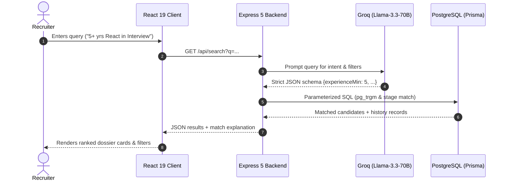

# Recruitment Management & AI Candidate Pipeline Platform

A modern, high-performance Recruitment Candidate Management and Natural Language Search platform built with **React 19**, **TypeScript**, **Node.js (Express 5)**, **Prisma ORM**, **PostgreSQL**, and **Groq (Llama-3.3-70B-Versatile)**.

---

## 🔗 Repository & Deliverables
- **GitHub Repository**: [https://github.com/ayushprajapati3002/RecruitmentSoftware](https://github.com/ayushprajapati3002/RecruitmentSoftware)
- **Architecture Documentation**: [docs/ARCHITECTURE.md](docs/ARCHITECTURE.md)
- **Architecture PDF Summary**: [docs/Recruitment_Software_Architecture.pdf](docs/Recruitment_Software_Architecture.pdf)
- **AI Chat Logs & Audit**: [AI_CHAT_LOGS/README.md](AI_CHAT_LOGS/README.md) & [AI_CHAT_LOGS/SESSION_HISTORY.md](AI_CHAT_LOGS/SESSION_HISTORY.md)

---

## ⚡ Key Features

- **Full Recruitment Pipeline Workflow**:
  - Structured stage progression: `Applied` ➔ `Screening` ➔ `Interview` ➔ `Offer` ➔ `Hired`.
  - Quick action controls to **Advance**, **Reject**, or **Archive** candidates.
  - Immutable audit history logging (`CandidateHistory`) preserving every transition timestamp and status change.
- **Natural Language Search Engine (NLP)**:
  - Understands conversational recruiter queries: e.g., *"Show candidates with 5+ years of experience in React and Node"*, *"Who is currently in the interview stage?"*, or *"Applicants who have a GitHub profile"*.
  - Powered by Groq-hosted Llama-3.3-70B with ultra-fast inference (<250ms), producing structured JSON queries.
  - Zero regex brittle failures: natural language is converted to type-safe parameterized SQL execution.
- **Responsive & Ergonomic UI**:
  - Handcrafted modern responsive UI with fluid spacing, responsive grid, dynamic drawer modals, and status badges.
  - Optimized for desktops, tablets, foldables, and ultra-narrow mobile screens.
- **Full Candidate Dossier**:
  - Detailed profiles including resume uploads, skill tags, LinkedIn/GitHub links, contact information, notes, and timeline audit logs.

---

## 🏗️ System Architecture Overview



### Components:
1. **Frontend**: React 19, TypeScript, Lucide Icons, Vanilla CSS design system (fluid responsive layout, CSS grid/flexbox, custom animations).
2. **Backend**: Express 5 on Node.js v24, TypeScript (`ts-node`/`nodemon`), Multer for resume file storage.
3. **Database & ORM**: PostgreSQL via Prisma ORM with raw SQL fallback for fuzzy and array search matching.
4. **NLP Processing Engine**: Groq SDK (`llama-3.3-70b-versatile`) translating free-form recruiter intent into strict JSON filter schemas.

---

## 🚀 Getting Started & How to Run

### Prerequisites
- **Node.js**: v18.x, v20.x, or v24.x
- **PostgreSQL**: PostgreSQL 14+ instance (or hosted on Supabase / Neon / Render)
- **Groq API Key**: (Free tier key from [Groq Console](https://console.groq.com/))

### 1. Backend Setup

1. Open a terminal and navigate to `backend/`:
   ```bash
   cd backend
   ```
2. Install dependencies:
   ```bash
   npm install
   ```
3. Configure environment variables:
   Create a `.env` file in the `backend/` folder:
   ```env
   PORT=5000
   DATABASE_URL="postgresql://<user>:<password>@<host>:<port>/<database>?schema=public"
   DIRECT_URL="postgresql://<user>:<password>@<host>:<port>/<database>?schema=public"
   GROQ_API_KEY="gsk_your_groq_api_key_here"
   ```
4. Run database migrations / push schema:
   ```bash
   npx prisma db push
   ```
5. Start the backend development server:
   ```bash
   npm run dev
   ```
   *The backend will boot up at `http://localhost:5000`.*

---

### 2. Frontend Setup

1. Open a second terminal and navigate to `frontend/`:
   ```bash
   cd frontend
   ```
2. Install dependencies:
   ```bash
   npm install
   ```
3. Start the Vite development server:
   ```bash
   npm run dev
   ```
4. Open the application in your browser:
   ```
   http://localhost:5173
   ```

---

## 💡 Decisions Made and Rationale

| Decision | Alternative Considered | Rationale |
| :--- | :--- | :--- |
| **Groq Llama-3.3-70B for Query Parsing** | In-memory regex / standard Gemini Flash / Local Python Spacy | Sub-second extraction latency (<250ms), zero dependency on local Python ML runtime, high reasoning capacity for colloquial recruiter search intents. |
| **Prisma ORM with Immutable History Table** | Mutable single-table status flag | Recruitment workflows require legal compliance and candidate traceability. The `CandidateHistory` table is append-only with `onDelete: NoAction` to ensure complete audit history. |
| **Custom Vanilla CSS over TailwindCSS** | Tailwind CSS / Bootstrap | Complete design autonomy, zero utility bloat, micro-tailored fluid breakpoints for foldable and extreme mobile aspect ratios without conflicting CSS priority rules. |
| **Disk Storage for Resumes via Multer** | Base64 strings in database | Base64 in PostgreSQL causes database bloat and slow backup/query performance. Static file serving via `/uploads` is scalable and lightweight. |

---

## 🤝 AI Collaboration: Where We Disagreed

### Scenario: Offline Rule-Based Regex vs. Pure LLM Intent Parsing
- **AI Proposal**: During the implementation of natural language candidate search, the AI proposed a "Step 1: Offline Rule-Based NLP" layer that attempted to match keywords and regular expressions (e.g. `/(applied|screening|interview|offer|hired)/i`, `/(\d+)\+?\s*years?/i`) before contacting the model.
- **My Disagreement**: I explicitly requested the AI to remove this rule-based step:
  > *"Don't want this Step 1: Offline Rule-Base NLP. Remove the changes of step 1 only."*
- **Why I Disagreed**:
  1. **Brittle Semantics**: Natural queries like *"candidates with solid frontend background stuck in screening for more than 2 weeks"* easily fool keyword heuristics (e.g., matching "screening" or "frontend" as notes vs. stages).
  2. **Codebase Complexity**: Maintaining a regex grammar alongside an LLM adds duplicate logic and brittle edge cases.
  3. **Performance Reality**: With Groq's high-speed inference, the LLM round-trip takes under 250ms, making a fragile fallback regex parser completely redundant.
  - *Full logs and context are available in [AI_CHAT_LOGS/README.md](AI_CHAT_LOGS/README.md).*

---

## 🔮 What I'd Do With More Time

1. **Semantic Vector Search (Hybrid Retrieval)**:
   - Combine the current structured SQL query engine with vector embeddings (using `pgvector` or ChromaDB) over candidate resumes and interview notes to support semantic similarity searches (e.g., *"Find candidates with experience similar to a Senior DevOps Architect"*).
2. **Automated Resume Parsing (OCR & Entity Extraction)**:
   - Implement an automated background worker that runs PDF/DOCX resumes through text extraction and LLM summarization to autofill skills, work history, and contact details upon upload.
3. **Interview Scheduling & Calendar Webhooks**:
   - Integrate Google Calendar / Microsoft Outlook APIs for one-click interview time-slot selection and automated email notifications to candidates.
4. **Multi-Tenant Role-Based Access Control (RBAC)**:
   - Add authentication (JWT / OAuth2) with distinct permission tiers (`Admin`, `Hiring Manager`, `Recruiter`, `Viewer`) to manage candidate pipeline access per job opening.
5. **Real-time Pipeline WebSockets**:
   - Add Socket.io or Server-Sent Events (SSE) so multi-recruiter teams see pipeline card movements and status updates in real-time without manual page refreshes.
